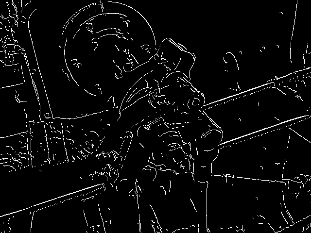
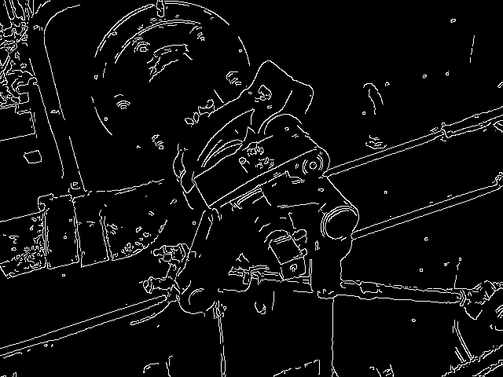

# image_processing
After the course Digital signals and images i wanted to learn more about image processing.

Currently there are only algorithms for:
* converting RGB to Grey Scale
* Canny edge detection
* Line detection
* more algorithms will appear here

# Canny edge detector 
Original image

Canny using my algorithm

Canny using openCv

