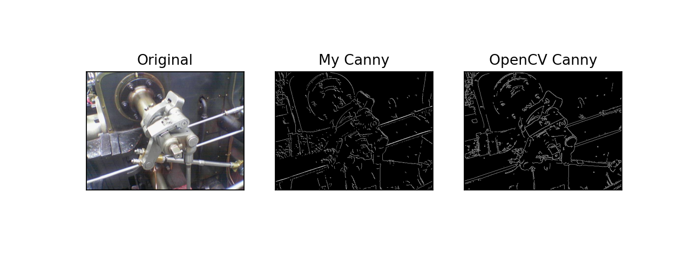
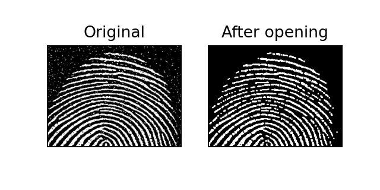
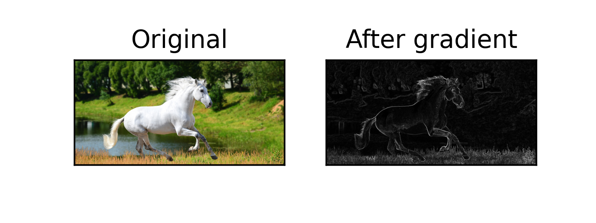
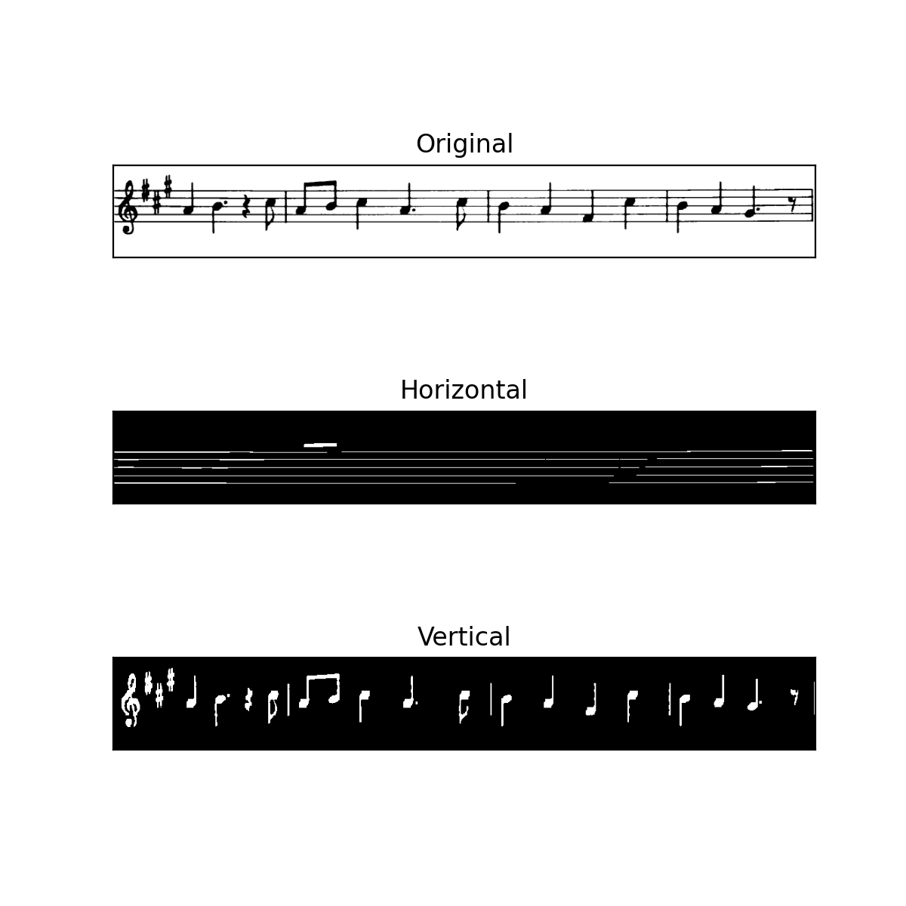

# image_processing
After the course Digital signals and images i wanted to learn more about image processing.

Currently, there are only algorithms for:
* Canny edge detection
  *  with Sobel kernels
* Line detection
* Morphological transformations:
  * opening
  * closing
  * gradient
  * black and top hat
  * hit miss
* converting RGB to Grey Scale
  * weighted
  * average
* more algorithms will appear here

# Canny edge detector

# Morphological transformations

Some common morphological transformations

Detecting edges of objects using erosion and dilation

